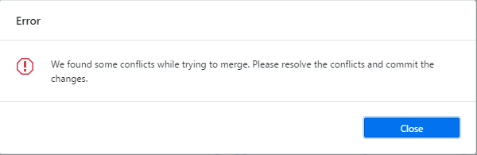
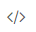
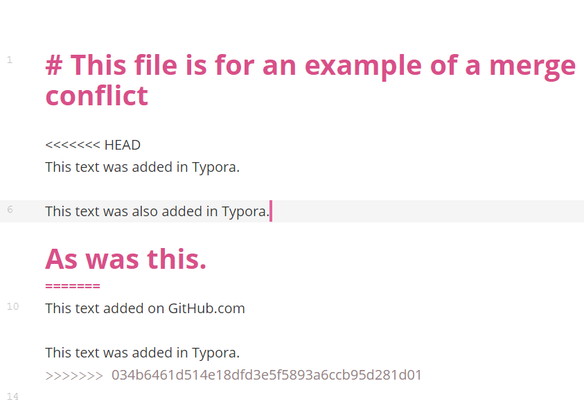
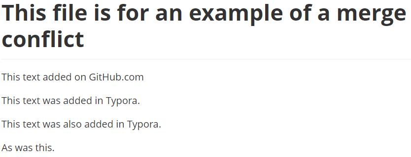

# GitHub Desktop Workflows

## Downloading a Repository

1. Select *File*
2. Select *Clone Repository*
3. Select desired repository
4. Select *Clone*

## Swap between Repositories

1. Select *Current Repository*
2. Select desired repository

## Creating a Branch

1. Select *Current Branch*
2. Select *New*
3. Select branch to branch off of
4. Write branch name
5. Select *Create branch*

## Swapping between Branches

1. Select *Current Branch*
2. Select desired branch

## Uploading New Files to a Repository

1. Create new file in repository folder
2. In GitHub Desktop select files to push to Github.com
3. Write commit message in *Summary*
4. **Optional** Expand on commit message in *Description*
5. Select *Commit to <branch name>*
6. Select *Push Branch*

## Uploading changed Files to a Repository

1. Make changes to existing files
2. In GitHub Desktop select files to push to [Github.com]()
3. Write commit message in *Summary*
4. **Optional** Expand on commit message in *Description*
5. Select *Commit to <branch name>*
6. Select *Push Branch*

## Updating your branch with the latest files from the server

1. Select *Current Branch*
2. Select branch *Master*
3. Select *Fetch origin*
4. Return to previous branch
5. Select *Branch* from the tool bar
6. Select *Update from default branch*

## Download latest changes to a Branch from github.com

1. Make sure you are on the branch you want to pull from
2. Confirm that Typora is closed
3. Select *Fetch origin*

Issue discovered with this. While fetching changes from origin, GitHub Desktop refuses to fetch from github.com for as long as Typora is open. This is quite awkward. But might be manageable as this will mostly only matter when someone has been working from multiple computers.

## Comparing Changes

1. Save changes made in Typora
2. Open GitHub Desktop
3. Select desired file
4. View changes in preview window

These changes are also viewable on github.com when making a pull request.

## Resolving issues arising from other users changes

1. Upon seeing the following message:

2. Select the Repository dropdown
3. Select Pull from the dropdown menu
4. Open a file with a merge conflict
5. Open the file in Code mode by selecting:

6. The conflict will look something like this:

7. "<<<<<<< HEAD" Marks the start of your content
8. "======= " Marks the end of the your content and the start of changes brought into your content
9. ">>>>>>> " Marks the end of the changes brought into your content
10. Resolve which changes are to be kept and remove duplications.
11. Example of resolved conflict:

12. View resolved changes in GitHub Desktop
13. In GitHub Desktop write a summery of the changes
14. Select Commit to <branch name>
15. Select Push Origin

**NOTE** The "=======" That separates your content from content being brought in as part of a conflict also acts as method of creating a Heading 1 in the Markdown language. This is why it is easier to resolve these conflict in Code mode.
